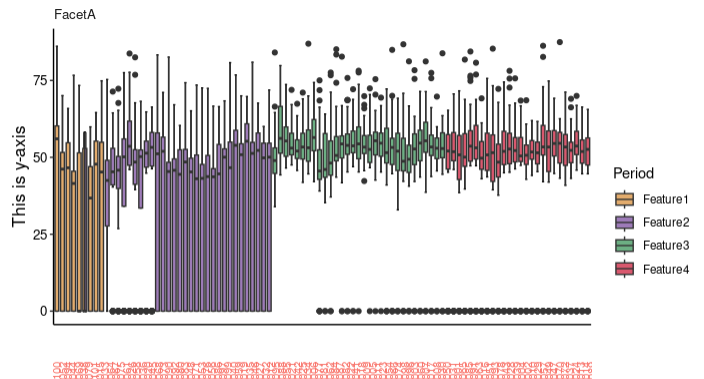
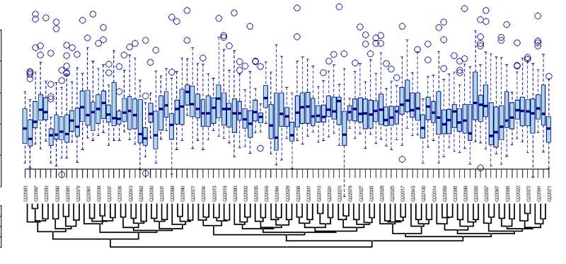

# aura-data
我曾经做过的数据分析外包单子

## 叠甲
鉴于国内数据分析市场的奇怪供需状态，本人已无力吐槽。肉眼可见的培训班割韭菜加上普遍落后时代的数据分析能力，需求和能力都让人无语的甲方。为了避免数据分析这个有趣的里世界彻底崩坏，本人把过去做过的数据分析接单内容都开源在这边。希望各位能一瞥数据分析的乐趣。
注：一下内容源于真实市场需求。同样，ai一直在过程中发挥作用，利用好ai。他们是摸鱼的好帮手。

## 准则
不流动的信息毫无价值。
完成自己擅长的部分。不要总是尝试在别人的专业内超过别人。

# 目录
1. 用于育种的基因谱系聚类分析
你的任务是忽略相关背景信息，根据给出reference画出最终图片。

上面是我完成的，很丑陋但是跑通了。下面是分享源码后客户自己完成的内容。beautiful。

by the way 你可以尝试一下posit could,在这个界面用r studio的感觉还是蛮奇妙的。上面这个案例就是在posit cloud完成的。

2. 奇怪的社会支持度分析（回归）
一个心理学学生的社会调查问卷分析，结论很好玩：独立程度影响相关信心。你可以试试。另外这单被鸽了。所以点名安徽医科大学某心理学专业在读学生。

3. 待续